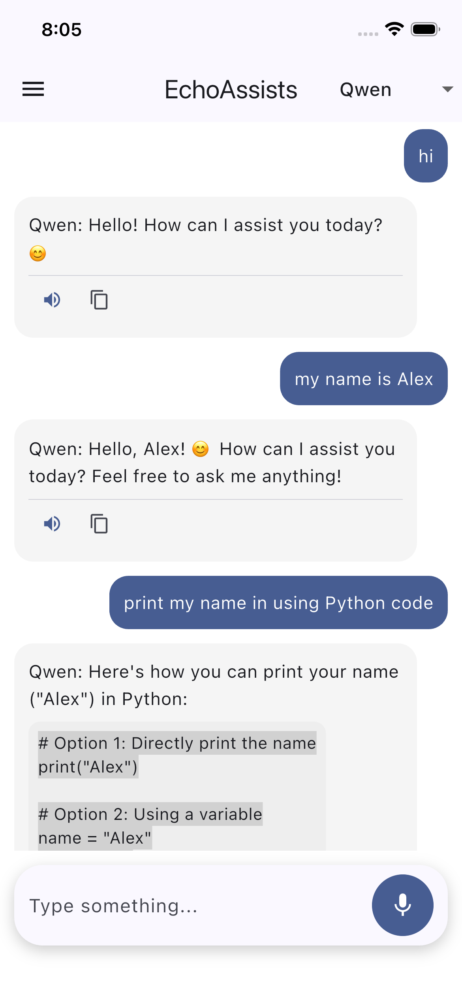
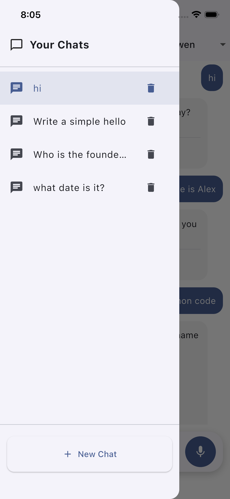
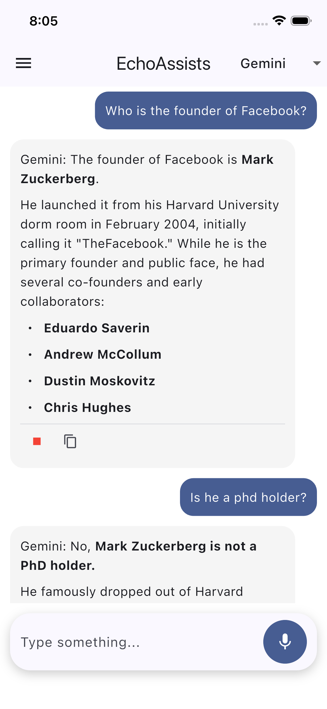
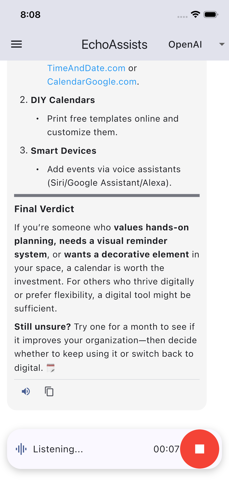

# GPTMesh — Multi-Model AI Voice Assistant

> A modern, full-stack AI assistant that lets users interact with multiple LLMs using **voice + text**, with **real-time context-aware conversations**, **local chat memory**, and a **ChatGPT-like experience**.

---

## Overview

**GPTMesh** is a powerful AI assistant platform that combines:

* Voice input (speech-to-text)
* AI voice responses (text-to-speech)
* Multi-chat conversation system
* Context-aware AI memory
* Multi-model support (OpenAI, Gemini, Claude, DeepSeek, Qwen)

Built with a **Flutter frontend** and a **Node.js backend**, GPTMesh delivers a smooth, scalable, and extensible architecture for real-world AI applications.

---

## Key Features

### 🎤 Voice + Text Interaction

* Speak naturally to the AI using voice input
* Type prompts like a traditional chat interface
* Seamless switching between input modes

---

### 🤖 Multi-Model AI Support

Choose between multiple AI providers dynamically:

* OpenAI
* Gemini
* Claude
* DeepSeek
* Qwen

➡️ Easily extendable to support future models

---

### 🧠 Context-Aware Conversations

* AI remembers previous messages in each chat
* Enables natural, human-like conversations
* Maintains separate context for each chat session

---

### 💬 Multi-Chat System

* Create unlimited chats
* Switch between conversations using sidebar (Drawer)
* Each chat maintains its own history and context

---

### 💾 Local Storage Persistence

* Chats are stored locally on the device
* No data loss after app restart
* Fast and offline-friendly chat history access

---

### 📝 Rich AI Responses

* Markdown rendering (headings, lists, formatting)
* Code block support
* Clean and readable UI like ChatGPT

---

### 🔊 Text-to-Speech (TTS)

* AI responses can be spoken aloud
* Toggle speech playback per message

---

### 📋 Copy to Clipboard

* Copy any AI response instantly
* Clean UX feedback

---

### 🎨 Modern UI/UX

* Dark & Light theme support
* ChatGPT-style message bubbles
* Smooth scrolling and interaction
* Minimal and clean design

---

## Project Structure

```
GPTMesh/
│
├── GPTMesh Backend/        # Node.js backend (AI APIs, routing)
│
├── GPTMesh Frontend/
│   └── gptmesh/           # Flutter application
│
└── README.md              # Project documentation
```

---

## Screenshots


### App Preview

| Chat Context     | Chat Switching     |
| ----------------- | ----------------- |
|  |  |

| Text to Speech      | Speech to Text      |
| ----------------- | ----------------- |
|  |  |

---

## Tech Stack

### Frontend

* Flutter
* Dart
* speech_to_text
* flutter_tts
* flutter_markdown
* shared_preferences

### Backend

* Node.js
* Express.js
* OpenAI API
* Gemini API
* Claude API
* DeepSeek API
* Groq API (Qwen)

---

## Getting Started

---

# 🔧 Backend Setup (Node.js)

### 1. Navigate to backend folder

```bash
cd "GPTMesh Backend"
```

---

### 2. Install dependencies

```bash
npm install
```

---

### 3. Create `.env` file

```env
OPENAI_API_KEY=your_openai_key
GEMINI_API_KEY=your_gemini_key
CLAUDE_API_KEY=your_claude_key
DEEPSEEK_API_KEY=your_deepseek_key
QWEN_API_KEY=your_qwen_key
PORT=3000
```

---

### 4. Start server

```bash
node server.js
```

Server will run at:

```
http://localhost:3000
```

---

# Frontend Setup (Flutter)

### 1. Navigate to frontend folder

```bash
cd "GPTMesh Frontend/gptmesh"
```

---

### 2. Install dependencies

```bash
flutter pub get
```

---

### 3. Update API URL

In your Flutter code:

```dart
const baseUrl = "http://YOUR_LOCAL_IP:3000/api/ai/ask";
```

> ⚠️ Use your local network IP (not localhost) when running on a real device.

---

### 4. Run the app

```bash
flutter run
```

---

## How It Works

1. User sends a message (text or voice)
2. Frontend converts voice → text (if needed)
3. Full chat context is sent to backend
4. Backend routes request to selected AI model
5. AI response is returned
6. Response is rendered with markdown + optional TTS

---

## What Makes GPTMesh Stand Out

* 🔥 **Multi-Model Flexibility**
  Switch between different AI providers in real-time

* 🧠 **Context-Aware Intelligence**
  Conversations feel natural and continuous

* 🎤 **Voice-First Experience**
  Fully integrated speech input & output

* ⚡ **Modular Architecture**
  Easy to extend, maintain, and scale

* 💾 **Offline-Friendly History**
  Local storage ensures persistence without backend dependency

---

## Contributing

Contributions are welcome!

1. Fork the repo
2. Create a new branch
3. Make your changes
4. Submit a pull request

---

## Author

**Abidur Rahman**
CSE Graduate | Web & Mobile Application Developer

---

> Built with passion to explore the future of AI-powered applications 🚀
